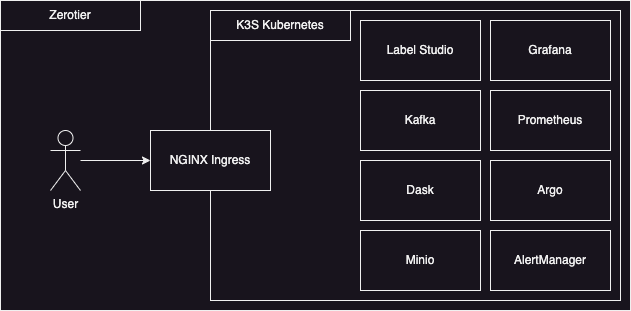

# KUBBY



So listen... what is Kubby? It really is just my personal Kubernetes manifest repository where I keep everything I want. But it can be more than that.

See I'm really into data science. But I absolutely hate paying for services. And I don't really have too! All the tools you and I need are open sourced already. The problem is they are just not organized.

That's what Kubby is. It's a completely self contained, personalized compute cluster, with every tool for data science you could want. No dependencies on cloud providers. This is meant for SUPER bare metal.

Like, I'm talking some old Raspberry Pi's, well used laptops, an old rusted friends NVIDIA GPU desktop computer, and pretty much any device that can install Kubernetes and the ZeroTier client.

Come include your friends too! Because it doesn't matter where in the world you are (as long as you have internet), you can join the cluster and start contributing to the compute power. For instance, I have a couple of machines at my own apartment (where I don't have access to the router as I share it with roomates). I have another couple machines at my local office. Then a couple of buddies of mine setup some machines as well. Finally, I have a client on my phone and personal laptop.

# Installation

## Install Zerotier

Setup some other stuff

```
sudo apt install openssh-server curl

sudo ufw disable
```

Install zerotier normally through their process. But disable routing via flannel (I default to use flannel with K3S).

```
curl -s https://install.zerotier.com | sudo bash


sudo zerotier-cli join <network_id>


nano /var/lib/zerotier-one/local.conf

{
  "settings": {
    "interfacePrefixBlacklist": [ "flannel" ]
  }
}
```

## Install K3S

### Install Control Plane

```
curl -sfL https://get.k3s.io | INSTALL_K3S_EXEC="--node-ip=172.23.0.100 --flannel-iface=ztwdjhesdk --disable=traefik --disable=servicelb" INSTALL_K3S_VERSION="v1.25.7+k3s1" sh -
```

### Install Worker Node

```
curl -sfL https://get.k3s.io | INSTALL_K3S_EXEC="--node-ip=172.23.0.102 --flannel-iface=ztwdjhesdk" K3S_URL="https://172.23.0.100:6443" INSTALL_K3S_VERSION="v1.25.7+k3s1" K3S_TOKEN="K10f0854fd03b7effd479a985188d862cb475696c3742af9718179f2f41fa0d1b5e::server:8afb4379f2f387cf5db6765bdc2df6c2" sh -
```

Then make sure you update the `/etc/hosts` file on each one of the nodes with the newly provisioned worker node

# Future Plans

- [] add label-studio UI to start annotating data
- [] add segment-anything ML auto-annotation for label-studio for faster annotation
- [] add nginx-ingress-controller and MetalLB to replace NodePort
- [] add kubby-node operator to add nodes to the cluster. Integrate with AWS, Vast.AI
- [] add DNS in ZeroTier mapping to MetalLB
- [] add Spark Cluster
- [] add support for multiple Kubernetes clusters